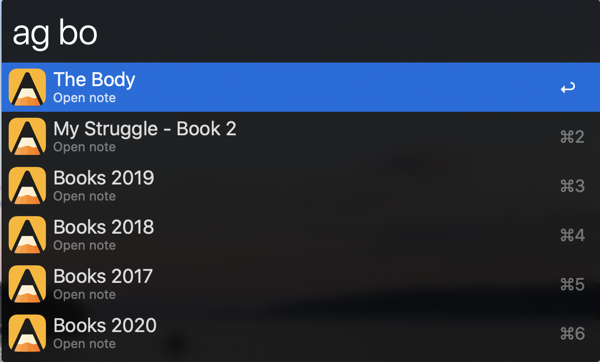
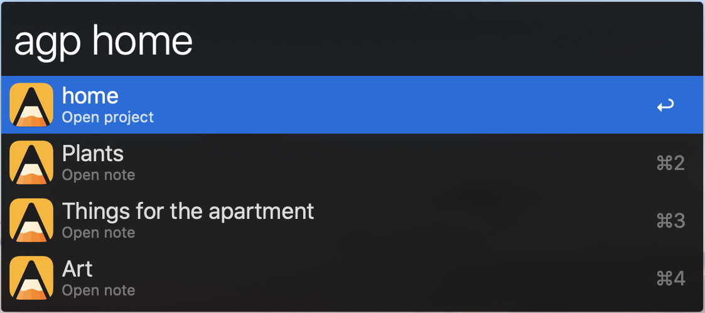

:warning: **This repo is no longer being maintained since I don't use Agenda any more.**

# Agenda Alfred Workflow

[Alfred workflow](https://www.alfredapp.com/workflows/) to search and open notes and projects in [Agenda](http://www.agenda.com/).

## Install
To install, download a [released alfred-agenda workflow](https://github.com/pcatterall7/alfred-agenda/releases/download/v0.2/Agenda.alfredworkflow) and double-click to open in Alfred.

## Searching and opening results 
`ag` - Search for a note by title and open it in Agenda.

`agp` - Search for a project (and comprising notes) by project title and open it in Agenda.

## Todo
- Create a new note.
- Append text to an existing note.
- Show the dates of notes when searching.

## Thanks
- [chrisbro](https://github.com/chrisbro) for building an awesome [Bear Alfred workflow](https://github.com/chrisbro/alfred-bear) which this project is forked from.
- [deanishe](https://www.alfredforum.com/profile/5235-deanishe/) for his excellent [Python workflow library](http://www.deanishe.net/alfred-workflow/index.html).
- [CCL Group](https://github.com/cclgroupltd) for their [Python binary plist](https://github.com/cclgroupltd/ccl-bplist) library.

## Versions
### 0.2
* Search results subtitle now shows date/time of the note instead of just "Open Note".
* **Bug fix:** Workflow update config was still tied the [Bear workflow](https://github.com/chrisbro/alfred-bear).

**0.1:** Initial public release.
